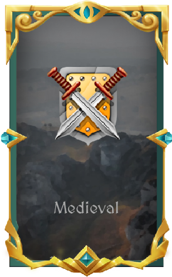
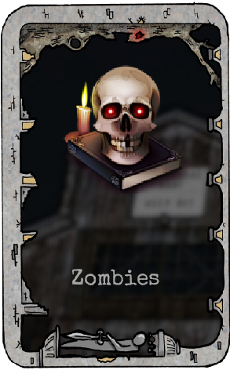

# Foil slider

This slider is designed to display three elements as a mini-catalog or 
mode/game selector/...

PAY ATTENTION

Currently it only works with one instance. 

This software is in a fully alpha version and its stability, performance or 
side effects is not assured.

 
 
 
Setup proyect and repository

## Getting Started

To use this plugin it is necessary to include the latest version of jQuery 
currently available in [3.x](https://releases.jquery.com/)

You must include/copy the plugin, which is currently located in the directory

    yas-slider/foil-slider.js
  
Finally, the css file must be linked/copy:

    style.css

This is generated from a Sass compiler from the source file style.scss. 
Currently the styles applied are example styles and we try to keep the responsibility for
the size to the developer to apply their own customization styles. 

## Running 

To create a new instance it is necessary to create a div with the data-attribute
of [foil-slider] and inside it must contain the images that we want to show in the 
show in the slider:

```html 
<div class="my-slider" foil-slider>
    
    
     
</div> 
```

It is important to note that currently it only works with img elements only. 
The slider transforms into divs with a series of options and settings.

Then in our javascript we will create the instance:

 ```javascript
 $(function($){
    "use strict";

    // foillider instance
    $('.my-slider').foilSlider({});
});
```

